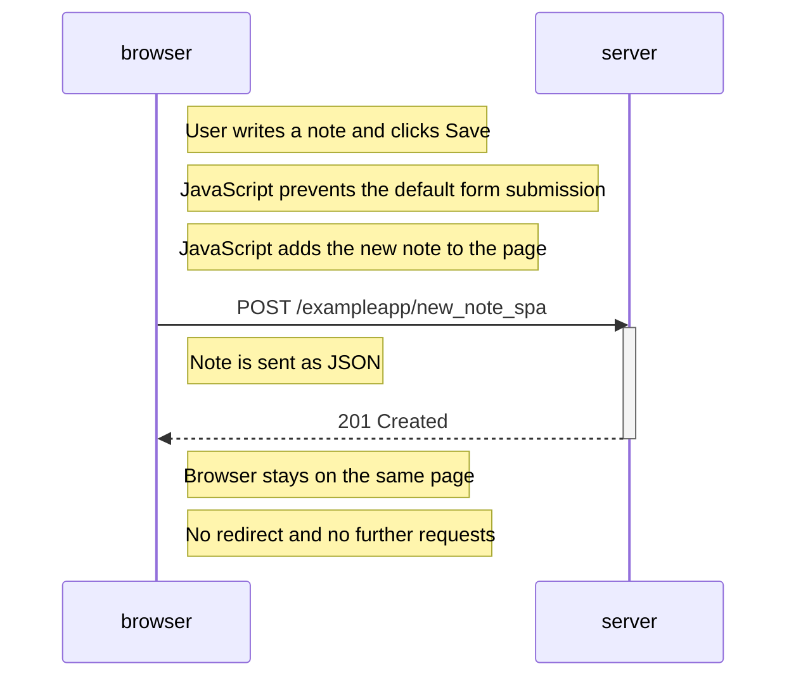

```mermaid
sequenceDiagram
    participant browser
    participant server

    Note right of browser: User writes a note and clicks Save

    Note right of browser: JavaScript prevents the default form submission
    Note right of browser: JavaScript adds the new note to the page

    browser->>server: POST /exampleapp/new_note_spa
    activate server
    Note right of browser: Note is sent as JSON
    server-->>browser: 201 Created
    deactivate server

    Note right of browser: Browser stays on the same page
    Note right of browser: No redirect and no further requests
```